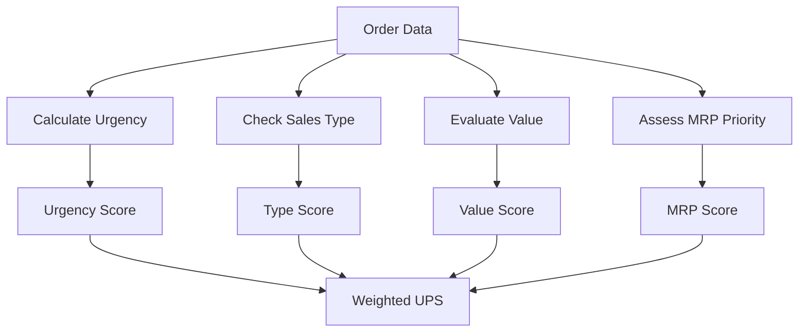

# 🏭 **Sequence Scheduler** - Intelligent Production Planning & Scheduling System

[](https://www.python.org/downloads/)
[](https://pandas.pydata.org/)
[](https://openpyxl.readthedocs.io/)
[](LICENSE)

**Sequence Scheduler** is a sophisticated production planning and scheduling system that optimizes manufacturing order sequences using advanced algorithms and priority scoring. The name perfectly captures the core functionality - intelligently sequencing and scheduling production orders for maximum efficiency.


## 🔧 Algorithm Details

### 1. Data Processing Pipeline


### 2. UPS Scoring System


### 3. Scheduling Algorithm


## 🎯 Overview

**Sequence Scheduler** processes manufacturing orders from Excel files and generates optimized production schedules. It uses a sophisticated scoring algorithm (UPS - Urgency, Priority, and Sales Score) to determine the optimal sequence of orders for each machine.

### Key Capabilities:
- 📊 **Data Processing**: Cleans and validates production data from Excel sheets
- 🎯 **Priority Scoring**: Calculates UPS scores based on urgency, sales type, value, and MRP priority
- ⚙️ **Machine Scheduling**: Optimizes production sequences for multiple machines
- 🧩 **Mould Grouping**: Groups orders by mould type for efficient setup
- 📈 **Output Generation**: Creates detailed Excel reports with scheduled production plans

## ✨ Features

### 🔥 Core Features
- **Multi-Machine Scheduling**: Handles multiple production machines simultaneously
- **Intelligent Priority Scoring**: Combines urgency, value, and business rules
- **Mould Optimization**: Minimizes setup time by grouping similar moulds
- **Excel Integration**: Seamless import/export with Excel files
- **Date Handling**: Robust date parsing and scheduling

### 📊 Scoring Algorithm (UPS)
The system calculates a comprehensive UPS score based on:

| Factor | Weight | Description |
|--------|--------|-------------|
| **Urgency Score** | 50% | Based on days to deadline |
| **Type Score** | 30% | Sales reference priority |
| **Value Score** | 10% | Order value importance |
| **MRP Score** | 10% | Manufacturing priority |

### 🎨 Visual Output
- **Machine-specific sheets** in Excel output
- **Formatted dates** and times
- **Rounded numerical values** for readability
- **Comprehensive scheduling details**

## 🚀 Installation

### Prerequisites
- Python 3.8 or higher
- pip package manager

### Step-by-Step Installation

1. **Clone the repository**
   ```bash
   git clone https://github.com/gopiyadav989/sequence_scheduler.git
   cd sequence_scheduler
   ```

2. **Create a virtual environment** (recommended)
   ```bash
   python -m venv .venv
   ```

3. **Activate the virtual environment**
   ```bash
   # On macOS/Linux:
   source .venv/bin/activate
   
   # On Windows:
   .venv\Scripts\activate
   ```

4. **Install dependencies**
   ```bash
   pip install -r requirements.txt
   ```

## 📖 Usage

### Basic Usage

1. **Prepare your input file**
   - Ensure your Excel file (`production planning.xlsx`) contains:
     - Orders sheet with production data
     - Machines sheet with machine specifications

2. **Run the application**
   ```bash
   python index.py
   ```

3. **Check the output**
   - Generated `output.xlsx` file contains:
     - One sheet per machine
     - Optimized production schedules
     - UPS scores and timing details

### Input File Structure

Your Excel file should contain two sheets:

#### Orders Sheet
| Column | Description |
|--------|-------------|
| `prod_order` | Production order number |
| `machine` | Machine identifier |
| `mould` | Mould type |
| `order_qty` | Quantity to produce |
| `processing_time` | Processing time per unit |
| `order_value` | Total order value |
| `needed_on` | Required delivery date |
| `priority` | MRP priority level |
| `ref_sales_id` | Sales reference (if applicable) |

#### Machines Sheet
| Column | Description |
|--------|-------------|
| `machine` | Machine identifier |
| `weekly_hours` | Available hours per week |
| `estimated_availability` | Machine availability factor |


## 📁 File Structure

```
sequence_scheduler/
├── 📄 index.py                 # Main application file
├── 📊 production planning.xlsx # Input data file
├── 📈 output.xlsx             # Generated schedules
├── 📋 requirements.txt        # Python dependencies
├── 📖 README.md              # This file
├── 🚫 .gitignore             # Git ignore rules
└── 🐍 .venv/                 # Virtual environment
```

## 📦 Dependencies

| Package | Version | Purpose |
|---------|---------|---------|
| `pandas` | 2.3.2 | Data manipulation and analysis |
| `openpyxl` | 3.1.5 | Excel file reading/writing |
| `xlsxwriter` | 3.2.5 | Excel output formatting |

## 🛠️ Configuration

### Customizing the Algorithm

You can modify the scoring weights in `index.py`:

```python
# Current weights in calculate_ups function
df["ups"] = (df["urgency_score"] * .5) +      # 50% weight
            (df["type_score"]*.3) +            # 30% weight
            (df["value_score"]*0.1) +          # 10% weight
            (df["mrp_score"]*0.1)              # 10% weight
```

### Adjusting Urgency Scoring

Modify the urgency function in `calculate_ups()`:

```python
def fx(a):
    if a <= 1:
        return 50    # Critical: 1 day or less
    elif a <= 3:
        return 40    # High: 2-3 days
    elif a <= 7:
        return 30    # Medium: 4-7 days
    elif a <= 14:
        return 20    # Low: 8-14 days
    else:
        return 5     # Very low: 15+ days
```

## 🤝 Contributing

1. Fork the repository
2. Create a feature branch (`git checkout -b feature/amazing-feature`)
3. Commit your changes (`git commit -m 'Add amazing feature'`)
4. Push to the branch (`git push origin feature/amazing-feature`)
5. Open a Pull Request


## 📄 License

This project is licensed under the MIT License - see the [LICENSE](LICENSE) file for details.

## 🆘 Support

If you encounter any issues:

1. Check the [Issues](../../issues) page
2. Create a new issue with detailed information
3. Include your input file structure and error messages

## 🔮 Future Enhancements

- [ ] **Web Interface**: Create a web-based UI for easier interaction
- [ ] **Real-time Updates**: Live scheduling updates
- [ ] **Advanced Analytics**: Production efficiency metrics
- [ ] **API Integration**: Connect with ERP systems
- [ ] **Machine Learning**: Predictive scheduling optimization

---

<div align="center">
  <p>Made with ❤️ for efficient production planning</p>
  <p>⭐ Star this repository if you find it helpful!</p>
</div>
